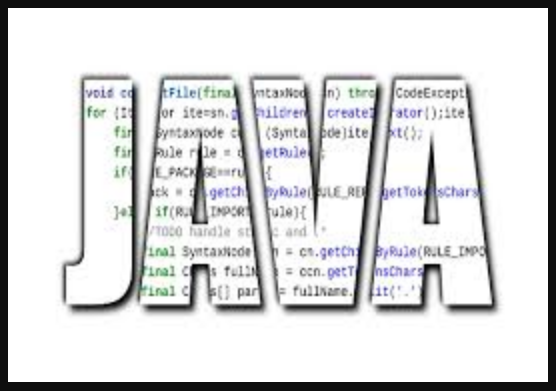
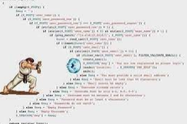
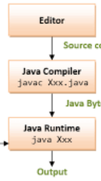
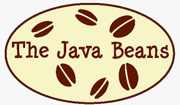
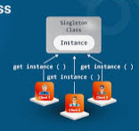
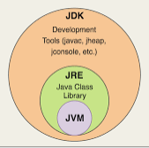

<!-- PROJECT SHIELDS -->

[![Contributors][contributors-shield]][contributors-url]
[![Forks][forks-shield]][forks-url]
[![Stargazers][stars-shield]][stars-url]
[![Issues][issues-shield]][issues-url]
[![MIT License][license-shield]][license-url]
[![LinkedIn][linkedin-shield]][linkedin-url]

<!-- PROJECT LOGO -->

- <DIR>          - [ Boas Praticas Assert  ](Assert)
- <DIR>          - [ Bin   ](bin)
- <DIR>          - [ Caracteristicas Java   ](caracteristicas-da-linguagem-java)
- <DIR>          - [ Caracteristicas Java 2   ](caracteristicas-da-linguagem-java-2)
- <DIR>          - [ Debug   ](debug-de-codigo)
- <DIR>          - [ Deploy   ](Deploy)
- <DIR>          - [ Desafio de Codigo   ](DesafioDeCodigo)
- <DIR>          - [ Heroku   ](Heroku)
- <DIR>          - [ Maven   ](IntroducaoAoMaven)
- <DIR>          - [ SDK Man   ](SDK_Man)
- <DIR>          - [ SOAP   ](SOAP)
- <DIR>          - [ Source   ](source)
- <DIR>          - [ Spring Boot   ](SpringBoot)
- <DIR>          - [ Teste   ](Teste Spring Boot)
- <DIR>          - [ Tutoriais   ](Tutoriais)
- <DIR>          - [ Hello World   ](HelloWorld_SpringBoot)

-  [ IFS Hadouken    ](ComoSeDefenderDe_IFS_HADOUKEN.Md)  : Como se defender de IFS Hadouken
-  [ Entendendo Java/JAVAC    ](EntendendoJava_JavaC.Md)  : Apontamentos espiando o JAVA e o JAVAC
-  [ Install JDK   ](InstalandoJavaJDK.Md)  : Instalando o Java JDK
-   [ Java Beans   ](IntroducaoAosJavaBeans.Md)  : Introduçao ao Java Beans
-  [ Java Parte I   ](JAVA_Apontamentos.Md)  : Apontamentos de Java Parte I
-   [ Java Parte II   ](JAVA_APontParteII.Md)  : Apontamentos de Java Parte II
-  [ Threads com Lambda   ](Java_ComoCriarUmaThreadComLambda.Md)  : Java como criar uma thread com Lambda
-  [ Maturidade da API   ](MedindoAMaturidadeDeSuaAPI.Md)  : Medindo a maturidade de sua API
-  [ PDD: Singleton   ](PadraoDeProjetoSingletonEmJava.Md)  : Conheça Padroes de Projeto em JAVA Singleton
-  [ JDK JRE JVM   ](QualADiferen‡aEntreJDK_JRE_JVM.Md)  : Qual a diferença entre JDK, JRE e JVM
-  [ Descubra a versao do Java  ](VersaoDoJavaInstalada.Md)  - Aprenda como saber qual a versao do JAVA instalada.

)  - 

Mergulhe no mundo Java
-   - Mergulhe no mundo Java
-   - Mergulhe no mundo Java

---

#### * DIO - Digital Inovation One *
######  [Inscreva-se na Dio](https://digitalinnovation.one/sign-up?ref=R5J3ZLTIFS)  

######  [Vagner Bellacosa perfil na Dio](https://web.digitalinnovation.one/users/vagnerbellacosa?tab=achievements)  

<!-- MARKDOWN LINKS & IMAGES -->
<!-- https://www.markdownguide.org/basic-syntax/#reference-style-links -->
[contributors-shield]: https://img.shields.io/github/contributors/VagnerBellacosa/Curso_JAVA.svg?style=for-the-badge
[contributors-url]: https://github.com/VagnerBellacosa/Curso_JAVA/graphs/contributors
[forks-shield]: https://img.shields.io/github/forks/VagnerBellacosa/Curso_JAVA.svg?style=for-the-badge
[forks-url]: https://github.com/VagnerBellacosa/Curso_JAVA/network/members
[stars-shield]: https://img.shields.io/github/stars/VagnerBellacosa/Curso_JAVA.svg?style=for-the-badge
[stars-url]: https://github.com/VagnerBellacosa/Curso_JAVA/stargazers
[issues-shield]: https://img.shields.io/github/issues/VagnerBellacosa/Curso_JAVA.svg?style=for-the-badge
[issues-url]: https://github.com/VagnerBellacosa/Curso_JAVA/issues
[license-shield]: https://img.shields.io/github/license/VagnerBellacosa/Curso_JAVA.svg?style=for-the-badge
[license-url]: https://github.com/VagnerBellacosa/Curso_JAVA/blob/master/LICENSE.txt
[linkedin-shield]: https://img.shields.io/badge/-LinkedIn-black.svg?style=for-the-badge&logo=linkedin&colorB=555
[linkedin-url]: https://www.linkedin.com/in/VagnerBellacosa/
[product-screenshot]: Image/capa.png

